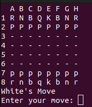
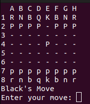

# ChessGame

## Description

simple chess game made using c++ 

## How to run

```bash

g++ main.cpp ChessBoard.cpp Piece.cpp App.cpp -o chessgame && ./chessgame

```

## How to play

- Enter the coordinates of the piece you want to move
- Enter the coordinates of the place you want to move the piece to

### Example



```bash
E2E4

```



### Continue until someone gets checkmated or the game ends in a draw
